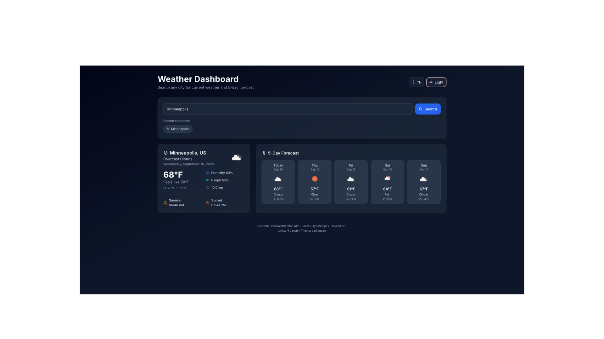
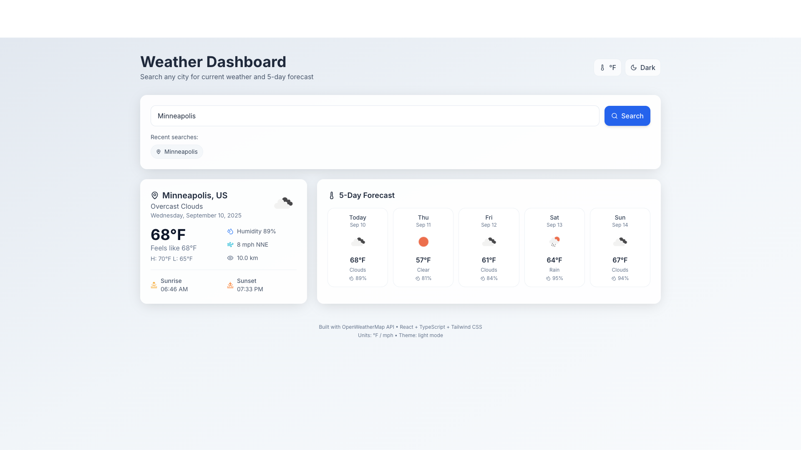

# 🌤️ Weather Dashboard

A clean and responsive weather application built with **React, TypeScript, Vite, and Tailwind CSS**.  
Search for any city worldwide to see the **current weather** and a **5-day forecast**, with light/dark mode and unit toggling (°F / °C).

🔗 **Live Demo:** [weather.abdulhamidoguntade.com](https://weather.abdulhamidoguntade.com/)

---

## ✨ Features
- 🌍 Search any city and get real-time weather data
- 📊 5-day forecast (summarized daily from 3-hour OWM data)
- 🌙 Light / Dark theme toggle
- 🌡️ °F / °C unit toggle
- 🕒 Recent searches saved in local storage
- 🎨 Weather-aware background gradients
- 📱 Fully responsive (mobile → desktop)

---

## 🖼️ Screenshots

### Dark Mode


### Light Mode


---

## 🛠️ Tech Stack
- **React 18 + Vite + TypeScript**
- **Tailwind CSS** for styling
- **Framer Motion** for subtle animations
- **Lucide React** for icons
- **OpenWeatherMap API** for weather data

---

## ⚡ Getting Started

### 1. Clone repo
```bash
git clone https://github.com/softwarehamid/weather-dashboard.git
cd weather-dashboard
